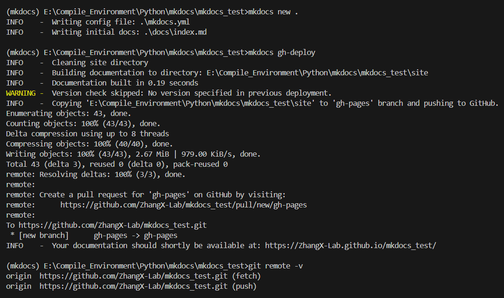
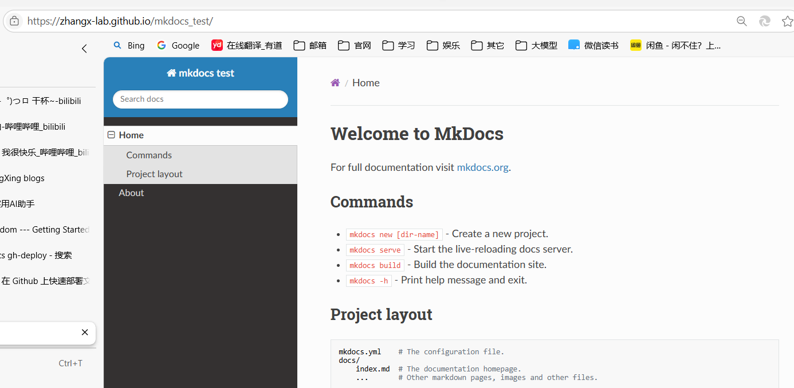
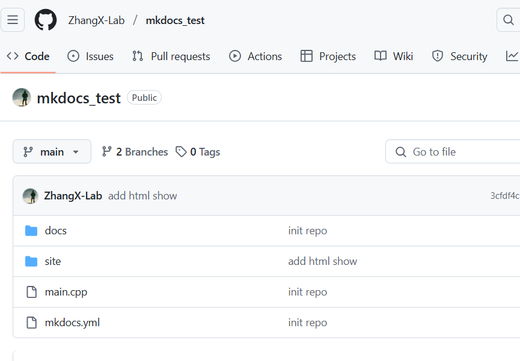

# mkdocs构建项目文档

首先，安装mkdocs，这是一个Python模块，因此，使用miniconda构建对应的虚拟环境，在安装mkdocs库。

```python
# 安装环境和库
conda create -n mkdocs python=3.9
conda activate mkdocs
pip install mkdocs

# 在自己的项目文件夹下
mkdocs new .
#在里面主要是修改mkdocs.yml文件和添加自己的md文件

# 本地查看演示效果
mkdocs serve
```

之后，部署到github中，作为项目的一部分。需要保准本地项目文件夹与远程github仓库进行关联，然后使用`mkdocs gh-deploy`进行自动部署，会自动创建gh-pages分支并且上传对应的代码。

> 注：需要保证本地项目名称和远程名称名字是一致的，不然不能自动部署。

<figure><figcaption></figcaption></figure>

成功之后，如下所示：

<figure><figcaption></figcaption></figure>

<figure><figcaption></figcaption></figure>

参考：[开始使用-Mkdom --- Getting Started - MkDocs](https://www.mkdocs.org/getting-started/)

[使用MkDocs轻松搞定Python项目文档 - 知乎](https://zhuanlan.zhihu.com/p/690666535)

[mkdocs 部署到github\_mkdocs github-CSDN博客](https://blog.csdn.net/m0_62342492/article/details/140589266)

