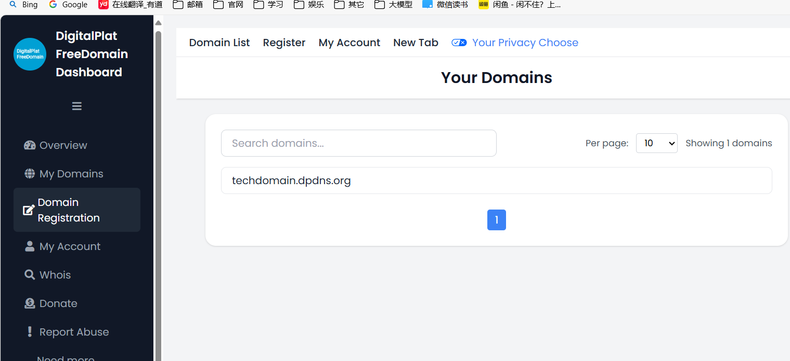
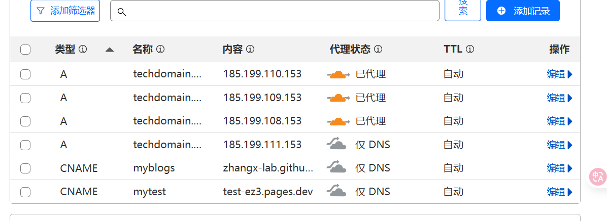
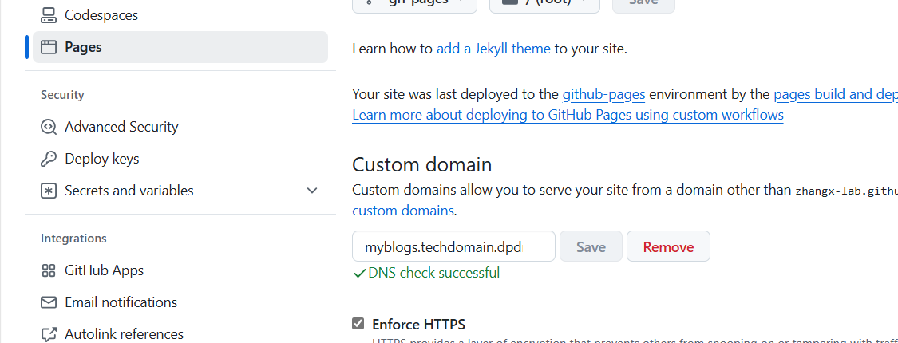
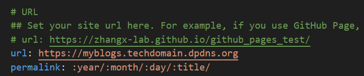
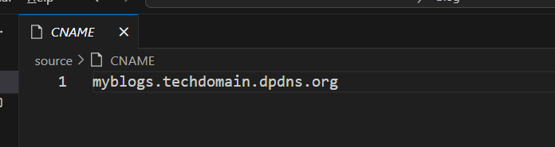
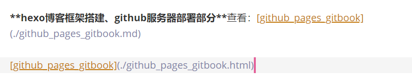

## 构建个人博客全流程

包含：hexo博客框架搭建、github服务器部署、免费域名获取、域名与github网址挂载(cloudflare)

**最终实现通过域名直接访问个人博客。**

**hexo博客框架搭建、github服务器部署部分**查看：[github_pages_gitbook](./github_pages_gitbook.md)

参考上述文档实现后，就能够实现利用github部署自己的博客网站，地址如：`zhangx-lab.github.io/github_pages_test/`

### 免费域名获取

- 什么是域名？

  域名是互联网上用于标识一个或多个IP地址的字符标识，它以一种便于人类记忆和书写的格式表示复杂的数字型IP地址。简单来说，域名就是互联网上的地址名称，比如“www.example.com”。用户可以通过输入域名来访问网站，而不需要记住难以记忆的IP地址。

**第一步**在[域名注册地址](https://dash.domain.digitalplat.org/auth/register)中注册一个账户，注册时个人的信息可以通过[美国身份证生成，美国人地址信息生成-世界各国身份信息、地址、信用卡生成器](https://www.shenfendaquan.com/)生成：

注册并登录账户之后，申请一个**免费的域名**，成功后就会获取一个免费的域名，该域名有一年的年限，快到期时可以更新再延一年，如此循环一直使用可以：

**第二步**，有了域名之后，就可以将其与github的地址进行映射，这里通过一个[cloudflare]([Cloudflare Dashboard | Manage Your Account](https://dash.cloudflare.com/0fcf9794ccadfda32d95f85464985460/home/domains))云平台进行托管，实现域名和具体地址(ip地址或者xxx.github.io/xxx/地址)映射挂载，实现域名访问github对应的地址，而自己的博客就在github对应的仓库中。

**具体包含两个部分，如下：**

**一个**是需要再cloudflare中对自己的域名进行托管(**添加域**)，然后添加DNS记录，记录githubip地址以及github.io，不需要具体的仓库，因为一个域名或者子域名只能够对应一个仓库：

**另一个**是在对应的github的指定仓库中的setting->Pages中添加自定义域名：

成功挂载之后就能够通过域名去访问部署在github仓库的博客，这里将github当做了服务器，如果想要自己搭建服务器，可以在一些云平台购买ip地址，再将ip地址与域名进行挂载，做法是类似的。

**最后**，还需要提及的一点就是，本地的hexo框架需要额外做一些改变，不然github上本来通过xxx.github.io/xxx/能够正常访问，挂载域名之后就不能正常访问。一个就是本地hexo代码中的_config.yml文件中的url：

另一个就是需要再source中添加一个CNAME文件，这个文件是github实现域名与地址映射的文件，会在github添加自定义域名时自动添加，但是当本地hexo修改代码上传之后就会将该文件删除，所以直接本地也创建这个文件一起上传，这样就避免了每次都去操作github添加自定义域名这一步。

参考：[免费域名能干什么？CDN，个人网站，访问家庭内网等_哔哩哔哩_bilibili](https://www.bilibili.com/video/BV1uAVLzCEmH/?spm_id_from=333.1387.upload.video_card.click&vd_source=f5a6ec0f0843c18c2ae2750754961170)

[【教程】Github Page 添加自定义域名_github pages 自定义域名-CSDN博客](https://blog.csdn.net/qq_34902437/article/details/140298754)

[hexo博客更换主题后，本地服务器运行成功，部署到github上就不能显示主题样式_为什么用hexo搭建好的博客,部署到github结果就不一样呢?-CSDN博客](https://blog.csdn.net/qq_43641373/article/details/107982229)

[【教程】hexo 更换主题后，部署在 Github Page 无 CSS 样式_hexo github css-CSDN博客](https://blog.csdn.net/qq_34902437/article/details/139752098)

[【教程】Hexo 部署到 Github Page 后，自定义域名失效的问题-CSDN博客](https://whybee.blog.csdn.net/article/details/140328361?spm=1001.2014.3001.5502)

[GitHub Pages 绑定自定义域名 + 开启 HTTPS | 青何博客](https://blog.ifback.com/article/github-pages-bind-custom-domain-and-enable-https/#cname-配置)

写在最后，如果想要为自己的公开的项目写一个展示文档，那么可以这么做，首先通过gitbook写相关的文档，并实现相关文件的跳转等联系，然后将生成的md文件放入到hexo框架中，hexo会将md文件转换为html文件，然后部署的项目仓库中的gh_pages分支中，这样就能够展示该项目的文档，让别人能够快速上手，此外，还可以向上述一样添加自己的域名（一般是子域名，顶级域名与github本身挂钩）进行访问改地址。

另一个方法是不借助hexo，而是直接将md文件生成为html文件，typora软件支持这么做，转换完之后，需要将用到的图片及其文件夹放在其同一目录，此外，想要几个html之间相互跳转，就需要在转换之前将md文件路径改成其md文件转为html文件后的路径。这样将相关文件上传到github的gh_pages仓库，在添加index.html仓库就可以进行展示。这种方法关键在于index.html的编写和网页样式可能就不太好看，但是可以参考下hexo的index.html以及借助AI辅助编写更好地页面。

最终从网上找了一个写文档更方便的项目文档展示框架库，就是mkdocs，详细见：[mkdocs构建项目文档](./mkdocs构建项目文档.md)

